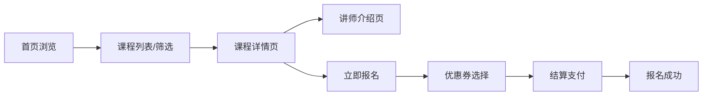

## 1. 产品概述
职业技能在线教育课程展示平台，面向职场人士和求职者，提供高品质职业技能培训课程，帮助用户提升专业能力、实现职业发展。
- 核心价值：精选优质课程、透明讲师信息、真实学员评价、便捷报名流程
- 目标用户：25-45岁职场白领、转行者、技能提升追求者

## 2. 核心功能

### 2.1 功能模块
1. **首页**：简洁顶部导航、Hero 品牌区、热门课程卡片网格、学员评价滚动展示
2. **课程列表页**：分类筛选、价格排序、分页加载、课程卡片展示
3. **课程详情页**：视频预览区、课程大纲（可展开折叠）、讲师信息、课程亮点
4. **讲师介绍页**：讲师履历、擅长领域、主讲课程、学员评分
5. **报名结算页**：订单确认、优惠券选择、支付方式、结算提交

### 2.3 页面详情
| 页面名称 | 模块名称 | 功能描述 |
|-----------|-------------|---------------------|
| 首页 | 顶部导航 | Logo、课程分类、讲师入口、登录/注册按钮 |
| 首页 | Hero 品牌区 | 主标题、副标题、CTA 按钮、背景装饰 |
| 首页 | 热门课程网格 | 课程卡片（讲师头像、课程名、价格、报名人数）、hover 上浮动效 |
| 首页 | 学员评价 | 横向无限滚动评价卡片、头像/评分/内容 |
| 课程列表页 | 筛选栏 | 分类标签筛选、价格排序（升/降序）、分页控件 |
| 课程列表页 | 课程卡片列表 | 响应式网格布局、与首页卡片一致交互 |
| 课程详情页 | 视频预览 | 左侧视频播放器、播放/暂停控制 |
| 课程详情页 | 大纲目录 | 右侧章节列表、可展开折叠、课时数、时长 |
| 课程详情页 | 讲师简介 | 头像、姓名、头衔、简介、评分 |
| 课程详情页 | 课程亮点 | 特色标签、学习目标、适合人群 |
| 讲师介绍页 | 个人档案 | 头像、姓名、职称、个人简介、从业经历 |
| 讲师介绍页 | 主讲课程 | 该讲师所有课程卡片列表 |
| 讲师介绍页 | 学员评价 | 针对该讲师的评价列表 |
| 报名结算页 | 订单信息 | 课程名称、价格、数量 |
| 报名结算页 | 优惠券 | 优惠券列表、选择/取消、折扣计算 |
| 报名结算页 | 支付信息 | 实付金额、支付方式选择、提交按钮 |

## 3. 核心流程
用户访问首页 → 浏览热门课程或使用筛选查找课程 → 点击课程卡片进入详情页 → 预览视频、查看大纲、了解讲师 → 点击立即报名进入结算页 → 选择优惠券 → 确认支付 → 完成报名

## 4. 用户界面设计

### 4.1 设计风格
- **主色调**：深蓝 `#0A1628`、中蓝 `#1E3A5F`、亮蓝 `#2563EB`
- **辅助色**：纯白 `#FFFFFF`、浅灰 `#F0F4F8`、渐变蓝 `linear-gradient(135deg, #2563EB 0%, #0EA5E9 100%)`
- **强调色**：金色 `#F59E0B`（优惠/推荐）、绿色 `#10B981`（成功/已报名）
- **按钮风格**：圆角 8px、蓝色渐变填充、hover 时轻微放大、阴影增强
- **字体**：思源黑体（Source Han Sans CN），标题 700，正文 400
- **布局风格**：卡片式设计、顶部固定导航、1440px 最大宽度居中
- **图标风格**：线性图标（Lucide），统一尺寸和颜色
- **动效**：卡片 hover 上浮 -4px + 阴影加深，页面切换淡入过渡，展开折叠平滑过渡

### 4.2 页面设计概览
| 页面名称 | 模块名称 | UI 元素 |
|-----------|-------------|-------------|
| 首页 | 顶部导航 | 固定定位、深蓝背景、白色文字、hover 下划线 |
| 首页 | Hero 区 | 左右分栏、左文右图、渐变 CTA 按钮、几何装饰 |
| 首页 | 课程卡片 | 圆角 12px、白色背景、讲师头像圆形、价格渐变高亮 |
| 首页 | 评价滚动 | 横向自动滚动、半透明卡片、星级评分、进度条 |
| 课程列表页 | 筛选栏 | 分类 pill 标签、排序下拉、分页按钮 |
| 课程详情页 | 视频大纲 | 左右 2:1 分栏、视频播放器深色主题、章节手风琴 |
| 报名结算页 | 结算卡片 | 三栏布局（订单/优惠/支付）、金额高亮加粗 |

### 4.3 响应式设计
- 桌面优先（1440px → 1024px）：保持多列布局，间距微调
- 平板（1024px → 768px）：课程网格从 4 列变为 3 列
- 移动端（<768px）：导航折叠为汉堡菜单，网格单列，视频大纲上下堆叠
- 触摸优化：按钮最小 44px 触摸区域，hover 效果改为 active 状态
