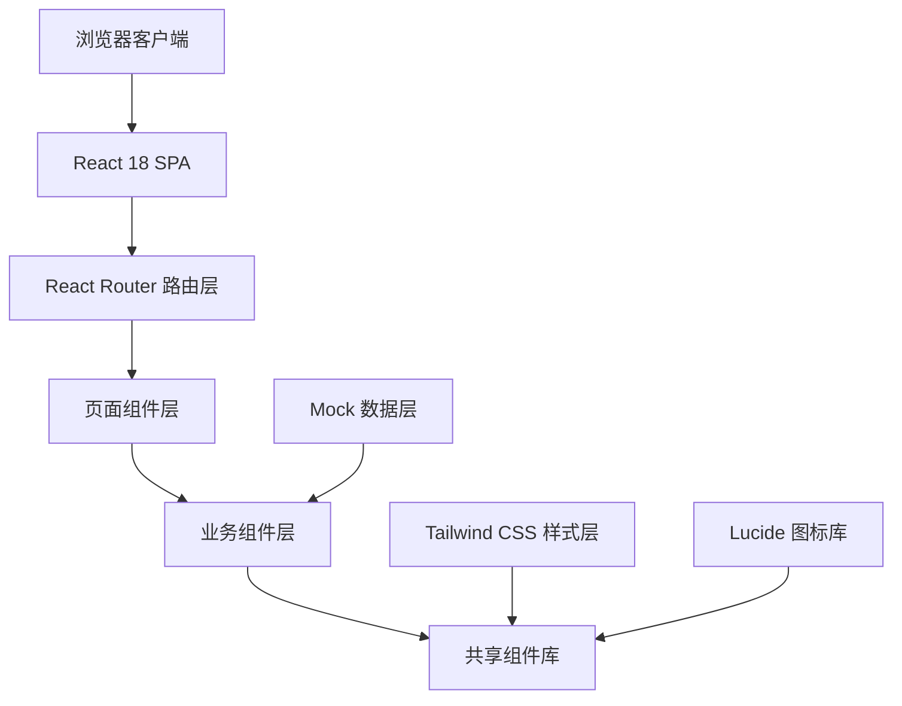

## 1. 架构设计



## 2. 技术描述
- **前端框架**：React@18 + TypeScript@5 + Vite@5
- **初始化工具**：Vite create-vite 脚手架
- **路由方案**：React Router DOM@6（BrowserRouter）
- **样式方案**：Tailwind CSS@3 + PostCSS + Autoprefixer
- **图标库**：Lucide React（线性风格图标）
- **数据方案**：本地 Mock 数据（TypeScript 类型定义 + JSON 对象）
- **字体加载**：Google Fonts Noto Sans SC（思源黑体 Web 版）
- **构建工具**：Vite 5（HMR 热更新、生产优化打包）

## 3. 路由定义
| 路由路径 | 页面组件 | 用途 |
|-------|---------|---------|
| `/` | HomePage | 首页，展示热门课程、品牌信息、学员评价 |
| `/courses` | CoursesPage | 课程列表页，支持分类筛选、排序、分页 |
| `/courses/:id` | CourseDetailPage | 课程详情页，视频预览、大纲目录、讲师介绍 |
| `/instructors/:id` | InstructorPage | 讲师介绍页，个人档案、主讲课程、评价 |
| `/checkout/:courseId` | CheckoutPage | 报名结算页，订单确认、优惠券、支付 |
| `*` | NotFoundPage | 404 页面 |

## 4. 数据模型

### 4.1 类型定义
```typescript
interface Course {
  id: string;
  title: string;
  description: string;
  price: number;
  originalPrice: number;
  coverImage: string;
  category: string;
  level: 'beginner' | 'intermediate' | 'advanced';
  duration: string;
  totalStudents: number;
  rating: number;
  reviewCount: number;
  instructorId: string;
  highlights: string[];
  suitableFor: string[];
  chapters: Chapter[];
}

interface Chapter {
  id: string;
  title: string;
  lessons: Lesson[];
}

interface Lesson {
  id: string;
  title: string;
  duration: string;
  isPreview: boolean;
}

interface Instructor {
  id: string;
  name: string;
  title: string;
  avatar: string;
  bio: string;
  experience: string[];
  specialties: string[];
  rating: number;
  studentCount: number;
  courseCount: number;
}

interface Review {
  id: string;
  userName: string;
  userAvatar: string;
  rating: number;
  content: string;
  courseId?: string;
  instructorId?: string;
  createdAt: string;
}

interface Coupon {
  id: string;
  code: string;
  name: string;
  discountType: 'fixed' | 'percentage';
  discountValue: number;
  minOrder: number;
  validUntil: string;
  isApplied: boolean;
}
```

### 4.2 Mock 数据规模
- 课程数据：12 条（覆盖 IT、设计、运营、产品等分类）
- 讲师数据：6 条
- 评价数据：18 条
- 优惠券数据：4 张

## 5. 核心组件清单
| 组件名称 | 路径 | 说明 |
|-------|------|------|
| `Navbar` | `components/layout/Navbar.tsx` | 顶部导航栏，固定定位 |
| `Footer` | `components/layout/Footer.tsx` | 底部信息栏 |
| `CourseCard` | `components/course/CourseCard.tsx` | 课程卡片，hover 上浮效果 |
| `CategoryFilter` | `components/course/CategoryFilter.tsx` | 分类筛选标签组 |
| `SortSelect` | `components/course/SortSelect.tsx` | 排序下拉选择器 |
| `Pagination` | `components/common/Pagination.tsx` | 分页组件 |
| `VideoPlayer` | `components/course/VideoPlayer.tsx` | 视频预览播放器 |
| `ChapterAccordion` | `components/course/ChapterAccordion.tsx` | 大纲手风琴（展开折叠） |
| `ReviewCarousel` | `components/review/ReviewCarousel.tsx` | 评价横向滚动 |
| `CouponSelector` | `components/checkout/CouponSelector.tsx` | 优惠券选择器 |
| `StarRating` | `components/common/StarRating.tsx` | 星级评分展示 |
